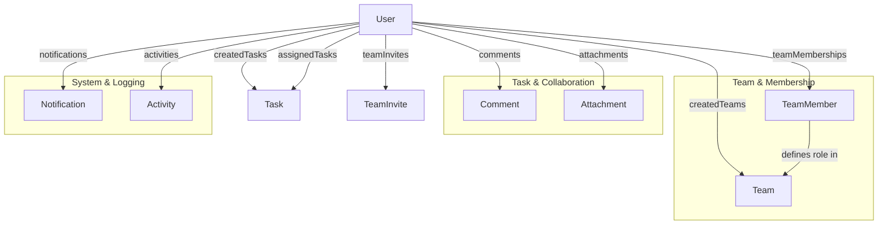

# Task Management System

Of course. This is a crucial planning step. Here's a comprehensive list of API routes you'll need to build for your Task Management System, organized by module.

# Task Management System
This document lists all planned API routes for the Task Management System, organized by module. Each route includes its implementation status.

---

## Authentication Routes (`/api/auth/[...]`)
| Method | Endpoint | Description | Status |
| :--- | :--- | :--- | :--- |
| `POST` | `/api/auth/register` | Create a new user account | <p style="color:green; font-weight:bold;">DONE</p> |
| `POST` | `/api/auth/login` | Login user & return JWT token | <p style="color:green; font-weight:bold;">DONE</p> |
| `POST` | `/api/auth/logout` | Logout user (invalidate token) | <p style="color:green; font-weight:bold;">DONE</p> |
| `PUT` | `/api/auth/verify` | Verify User | <p style="color:green; font-weight:bold;">DONE</p> |
| `GET` | `/api/auth/me` | Get current user's profile | <p style="color:green; font-weight:bold;">DONE</p> |
| `PUT` | `/api/auth/me` | Update current user's profile | <p style="color:green; font-weight:bold;">DONE</p> |
| `POST` | `/api/auth/forgot-password` | Request password reset email | <p style="color:green; font-weight:bold;">DONE</p> |
| `POST` | `/api/auth/reset-password` | Reset password with token | <p style="color:green; font-weight:bold;">DONE</p> |

---

## User Routes (`/api/users/[...]`)
| Method | Endpoint | Description | Status |
| :--- | :--- | :--- | :--- |
| `GET` | `/api/users` | Get all users (for mentions/search) | <p style="color:blue; font-weight:bold;">TODO</p> |
| `GET` | `/api/users/:userId` | Get a specific user's public profile | <p style="color:blue; font-weight:bold;">TODO</p> |
| `GET` | `/api/users/me/teams` | Get current user's teams & roles | <p style="color:blue; font-weight:bold;">TODO</p> |
| `GET` | `/api/users/me/tasks` | Get current user's assigned tasks | <p style="color:blue; font-weight:bold;">TODO</p> |
| `GET` | `/api/users/me/notifications` | Get current user's notifications | <p style="color:blue; font-weight:bold;">TODO</p> |
| `PUT` | `/api/users/me/notifications/read` | Mark notifications as read | <p style="color:blue; font-weight:bold;">TODO</p> |

---

## Project Routes (`/api/projects/[...]`)
| Method | Endpoint | Description | Status |
| :--- | :--- | :--- | :--- |
| `POST` | `/api/projects` | Create a new project | <p style="color:blue; font-weight:bold;">TODO</p> |
| `GET` | `/api/projects` | Get all projects owned or member-associated by current user | <p style="color:blue; font-weight:bold;">TODO</p> |
| `GET` | `/api/projects/:projectId` | Get details of a specific project | <p style="color:blue; font-weight:bold;">TODO</p> |
| `PUT` | `/api/projects/:projectId` | Update project details (Owner only) | <p style="color:blue; font-weight:bold;">TODO</p> |
| `DELETE` | `/api/projects/:projectId` | Delete/archive a project (Owner only) | <p style="color:blue; font-weight:bold;">TODO</p> |
| `GET` | `/api/projects/:projectId/teams` | Get all teams under a project | <p style="color:blue; font-weight:bold;">TODO</p> |
| `GET` | `/api/projects/:projectId/tasks` | Get all tasks under a project (aggregate from teams) | <p style="color:blue; font-weight:bold;">TODO</p> |
| `GET` | `/api/projects/:projectId/activity` | Get activity feed for a project | <p style="color:blue; font-weight:bold;">TODO</p> |

---

## Team Routes (`/api/teams/[...]`)
| Method | Endpoint | Description | Status |
| :--- | :--- | :--- | :--- |
| `POST` | `/api/teams` | Create a new team | <p style="color:blue; font-weight:bold;">TODO</p> |
| `GET` | `/api/teams` | Get all teams current user is member of | <p style="color:blue; font-weight:bold;">TODO</p> |
| `GET` | `/api/teams/:teamId` | Get a specific team's details | <p style="color:blue; font-weight:bold;">TODO</p> |
| `PUT` | `/api/teams/:teamId` | Update team details (Admin only) | <p style="color:blue; font-weight:bold;">TODO</p> |
| `DELETE` | `/api/teams/:teamId` | Delete a team (Owner only) | <p style="color:blue; font-weight:bold;">TODO</p> |
| `GET` | `/api/teams/:teamId/members` | Get all members of a team | <p style="color:blue; font-weight:bold;">TODO</p> |
| `POST` | `/api/teams/:teamId/invites` | Invite a user to a team (email) | <p style="color:blue; font-weight:bold;">TODO</p> |
| `GET` | `/api/teams/:teamId/invites` | Get pending invites for a team | <p style="color:blue; font-weight:bold;">TODO</p> |
| `DELETE` | `/api/teams/:teamId/invites/:inviteId` | Cancel an invite | <p style="color:blue; font-weight:bold;">TODO</p> |
| `POST` | `/api/teams/invites/:token/accept` | Accept a team invite (via email token) | <p style="color:blue; font-weight:bold;">TODO</p> |
| `POST` | `/api/teams/invites/:token/decline` | Decline a team invite | <p style="color:blue; font-weight:bold;">TODO</p> |
| `PUT` | `/api/teams/:teamId/members/:userId` | Update a member's role (Admin only) | <p style="color:blue; font-weight:bold;">TODO</p> |
| `DELETE` | `/api/teams/:teamId/members/:userId` | Remove a member from the team (Admin only) | <p style="color:blue; font-weight:bold;">TODO</p> |

---

## Task Routes (`/api/teams/:teamId/tasks/[...]`)
| Method | Endpoint | Description | Status |
| :--- | :--- | :--- | :--- |
| `POST` | `/api/teams/:teamId/tasks` | Create a new task in a team | <p style="color:blue; font-weight:bold;">TODO</p> |
| `GET` | `/api/teams/:teamId/tasks` | Get all tasks for a team (with filters) | <p style="color:blue; font-weight:bold;">TODO</p> |
| `GET` | `/api/teams/:teamId/tasks/:taskId` | Get a specific task's details | <p style="color:blue; font-weight:bold;">TODO</p> |
| `PUT` | `/api/teams/:teamId/tasks/:taskId` | Update a task | <p style="color:blue; font-weight:bold;">TODO</p> |
| `DELETE` | `/api/teams/:teamId/tasks/:taskId` | Delete a task | <p style="color:blue; font-weight:bold;">TODO</p> |
| `PUT` | `/api/teams/:teamId/tasks/:taskId/status` | Update task status (e.g., move on Kanban) | <p style="color:blue; font-weight:bold;">TODO</p> |
| `PUT` | `/api/teams/:teamId/tasks/:taskId/assign` | Assign/unassign a task to a user | <p style="color:blue; font-weight:bold;">TODO</p> |

---

## Comment Routes (`/api/teams/:teamId/tasks/:taskId/comments/[...]`)
| Method | Endpoint | Description | Status |
| :--- | :--- | :--- | :--- |
| `POST` | `.../comments` | Add a comment to a task | <p style="color:blue; font-weight:bold;">TODO</p> |
| `GET` | `.../comments` | Get all comments for a task | <p style="color:blue; font-weight:bold;">TODO</p> |
| `PUT` | `.../comments/:commentId` | Edit a comment | <p style="color:blue; font-weight:bold;">TODO</p> |
| `DELETE` | `.../comments/:commentId` | Delete a comment | <p style="color:blue; font-weight:bold;">TODO</p> |

---

## Attachment Routes (`/api/teams/:teamId/tasks/:taskId/attachments/[...]`)
| Method | Endpoint | Description | Status |
| :--- | :--- | :--- | :--- |
| `POST` | `.../attachments` | Upload a file to a task | <p style="color:blue; font-weight:bold;">TODO</p> |
| `GET` | `.../attachments` | Get all attachments for a task | <p style="color:blue; font-weight:bold;">TODO</p> |
| `DELETE` | `.../attachments/:attachmentId` | Delete an attachment | <p style="color:blue; font-weight:bold;">TODO</p> |

---

## Activity & Notification Routes (`/api/[...]`)
| Method | Endpoint | Description | Status |
| :--- | :--- | :--- | :--- |
| `GET` | `/api/teams/:teamId/activity` | Get recent activity for a team | <p style="color:blue; font-weight:bold;">TODO</p> |
| `GET` | `/api/me/activity` | Get current user's global activity feed | <p style="color:blue; font-weight:bold;">TODO</p> |

---

## Summary of Route Structure

Your API structure will look like this in the `app/api/` directory:

```
app/api/
├── auth/
│   ├── register/route.ts
│   ├── login/route.ts
│   ├── logout/route.ts
│   ├── me/route.ts
│   └── ...
├── users/
│   ├── route.ts          # GET /api/users
│   ├── [userId]/route.ts # GET /api/users/:userId
│   └── me/
│       ├── teams/route.ts
│       ├── tasks/route.ts
│       └── notifications/route.ts
├── teams/
│   ├── route.ts                      # GET, POST /api/teams
│   ├── [teamId]/
│   │   ├── route.ts                  # GET, PUT, DELETE /api/teams/:teamId
│   │   ├── members/
│   │   │   ├── route.ts              # GET /api/teams/:teamId/members
│   │   │   └── [userId]/route.ts     # PUT, DELETE /api/teams/:teamId/members/:userId
│   │   ├── invites/
│   │   │   ├── route.ts              # GET, POST /api/teams/:teamId/invites
│   │   │   └── [inviteId]/route.ts   # DELETE /api/teams/:teamId/invites/:inviteId
│   │   └── tasks/
│   │       ├── route.ts              # GET, POST /api/teams/:teamId/tasks
│   │       └── [taskId]/
│   │           ├── route.ts          # GET, PUT, DELETE /api/teams/:teamId/tasks/:taskId
│   │           ├── comments/
│   │           │   ├── route.ts
│   │           │   └── [commentId]/route.ts
│   │           └── attachments/
│   │               ├── route.ts
│   │               └── [attachmentId]/route.ts
│   └── invites/
│       └── [token]/
│           ├── accept/route.ts
│           └── decline/route.ts
└── me/
    ├── notifications/route.ts
    └── activity/route.ts
```

**Priority Order for Implementation (MVP First):**
1.  Auth Routes (`/api/auth/*`)
2.  Team Routes (`/api/teams`, `/api/teams/[teamId]`)
3.  Task Routes (`/api/teams/[teamId]/tasks`)
4.  Comment Routes
5.  Invite & Member Routes
6.  The rest (Attachments, Activity, etc.)


<hr>


